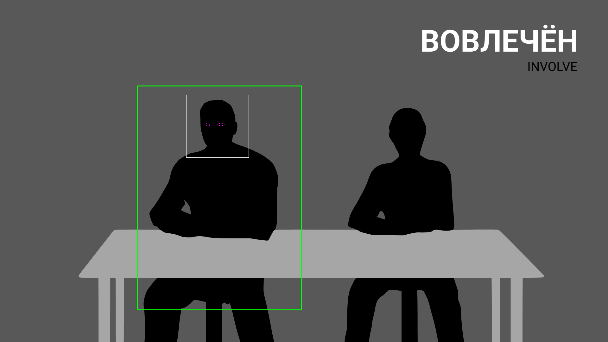
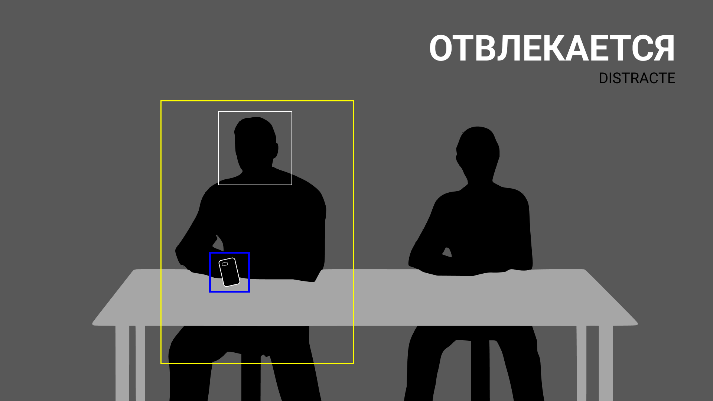
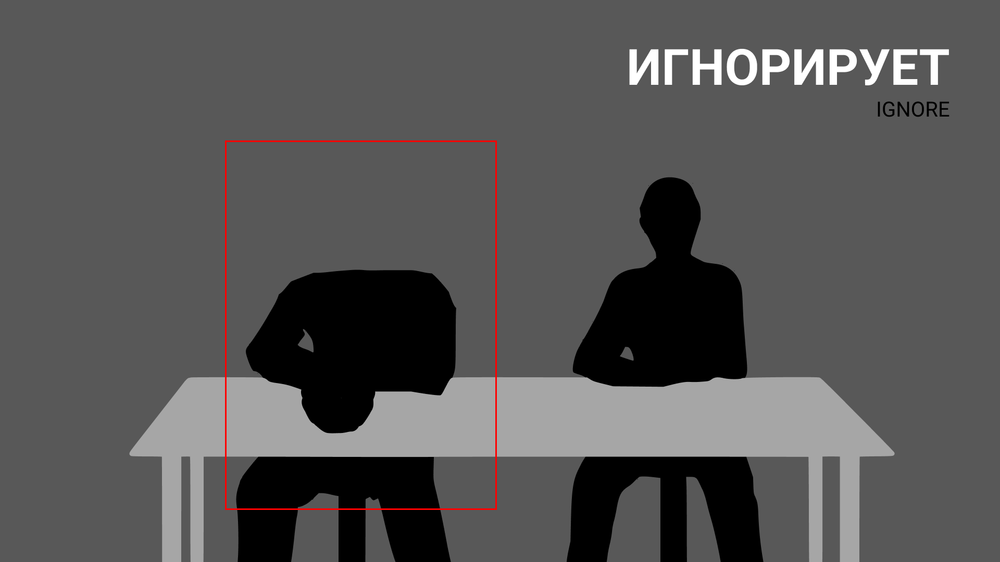
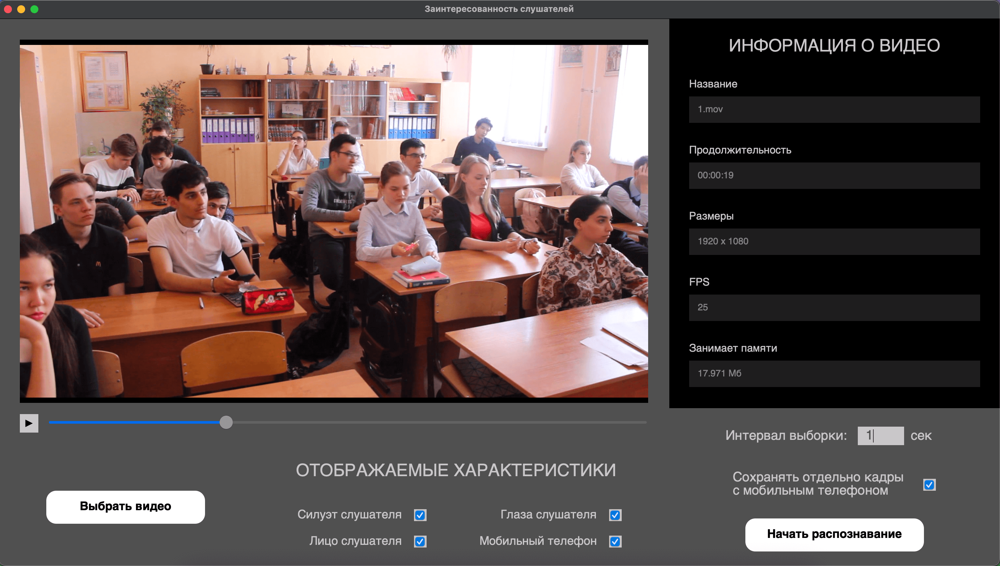
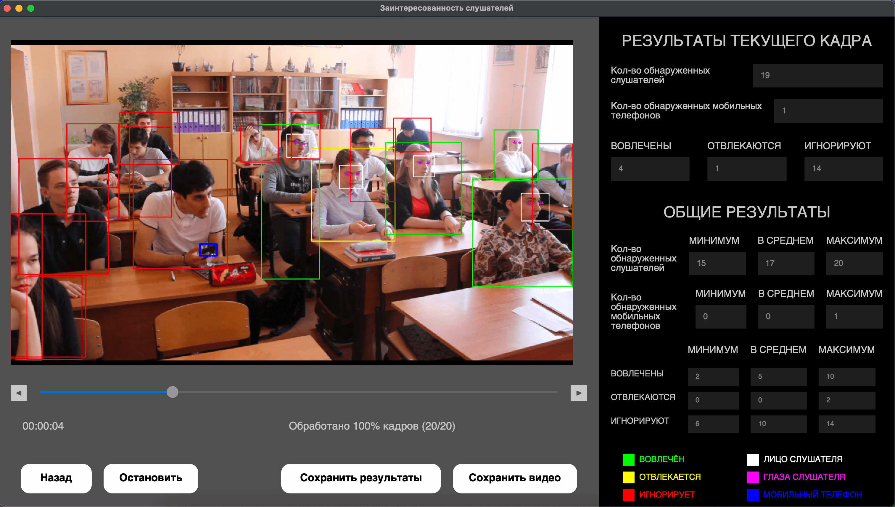

## Заинтересованность Слушателей (Audience Interest)

Программа на основе компьютерного зрения, позволяющая оценить заинтересованность слушателей по видеозаписи.

### Области применения

Можно использовать программу в сферах связанных с выступлениями, тренингами, мастер-классами, а также в образовательных организациях, так как поддерживаются любые видеозаписи, на которых присутствуют люди (слушатели).

Программа поддерживает все известные видеоформаты - MP4, AVI, MOV и др.

Выделим три состояния, в которых может находиться слушатель:

1. Вовлечён и следит за действиями докладчика (ВОВЛЕЧЁН / INVOLVE)

2. Каким-то образом отвлекается или с кем-то разговаривает (ОТВЛЕКАЕТСЯ / DISTRACTE)

3. Полностью или почти полностью игнорирует (ИГНОРИРУЕТ / IGNORE)

### GUI

Графический интерфейс, разработанного программного обеспечения, достаточно информативный и интуитивно понятный.
Имеется всего три экрана:
- начальный экран (StartWindow)
- экран импорта (ImportWindow)
- главный экран (MainWindow)

**Начальный экран** предоставляет возможность сразу выбрать видеозапись, с которой в дальнейшем будет работа.

**Экран импорта** позволяет посмотреть информацию о выбранной видеозаписи (название файла, продолжительность в формате HH:MM:SS, соотношение сторон, FPS, занимаемый объём в памяти) и сразу же настроить отображаемые характеристики (силуэт слушателя, лицо слушателя, глаза слушателя, мобильный телефон), которые будут визуализированы на следующем этапе распознавания.

Помимо этого, имеется возможность задать интервал выборки кадров из исходного видео. Такой подход увеличивает гибкость ПО и позволяет сократить время на обработку кадров, если запись статична и не требует постоянного контроля.

Дополнительным функционалом является сохранение отдельным видеорядом кадров с мобильным телефоном. При условии, что такие кадры будут обнаружены при распознавании.

Пользователь может просмотреть выбранное видео, воспользовавшись встроенным видеоплеером, или заменить файл, нажав кнопку «Выбрать видео».
Как только все подготовительные мероприятия будут выполнены, достаточно нажать «Начать распознавание» и увидеть следующий экран.

**Главный экран** полон информативных блоков, результатов распознавания и панелей управления.
С каждым новым обработанным кадром на экране обновляются «Результаты текущего кадра» и «Общие результаты».

Блок с результатами текущего кадра отображает:
- количество обнаруженных слушателей
- количество обнаруженных мобильных телефонов
- количество вовлечённых, отвлекающихся и игнорирующих слушателей

Блок с общими результатами имеет точно такой же набор отображаемых характеристик, выделяя среди всех обработанных кадров минимальные, средние и максимальные встречающиеся значения.

При необходимости, все результаты можно сохранить в виде текстового файла на компьютере пользователя нажав кнопку «Сохранить результаты».

Выбранные пользователем на экране импорта отображаемые характеристики после распознавания имеют следующие цвета и обозначения:
- 🟩 &ensp;зелёная рамка вокруг слушателя – слушатель вовлечён
- 🟨 &ensp;жёлтая рамка вокруг слушателя – слушатель отвлекается
- 🟥 &ensp;красная рамка вокруг слушателя – слушатель игнорирует
- ⬜️ &ensp;белая рамка в области слушателя – лицо слушателя
- 🟪 &ensp;розовый набор точек в области слушателя – глаза слушателя
- 🟦 &ensp;синяя жирная рамка – мобильный телефон

Большую часть видимой области экрана занимает модернизированный видеоплеер, который можно использовать для просмотра и переключения кадров даже до завершения обработки полного набора поступивших кадров.

В любой момент можно остановить процесс обработки нажав кнопку «Остановить».
При необходимости сохранить обработанные кадры достаточно нажать кнопку «Сохранить видео».
Вернуться на экран импорта можно нажав кнопку «Назад».

### Технологии

- **Python** - *основной язык программирования*
- **PyQt6** - *создание GUI*
- **OpenCV** - *компьютерное зрение*
- **dlib** - *распознавание лиц*
- **scipy** - *вычисление расстояния между ориентирами для глаз*
- **numpy** - *представление данных*
- **imutils** - *преобразование данных*

- **Нейронная модель YOLOv9** (ultralytics) - *детекция людей и мобильных телефонов на кадрах видео, а также определение координат их границ, которые в дальнейшем были использованы для отрисовки*

### Прямые ссылки на скачивание

Помимо стандартного запуска с помощью Python (`main.py`), предусмотрены запуски на Windows (`AudienceInterest.exe`) и на MacOS (`AudienceInterest.app`).

Windows - [Скачать](https://github.com/tambovnikita/AudienceInterest/releases/download/v1.0.0/AudienceInterest_Windows.zip)  
MacOS - [Скачать](https://github.com/tambovnikita/AudienceInterest/releases/download/v1.0.0/AudienceInterest_MacOS.zip)